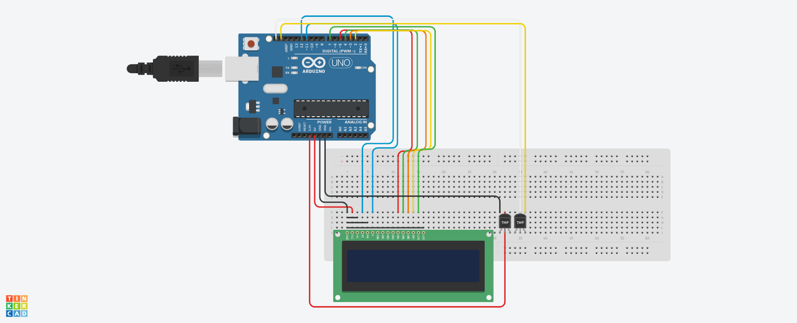

# Saturday-Six-Hours-Challenge
A digital thermometer with Arduino.

## Description:
Our project is a digital thermometer with 1 second delay. You can connect Arduino with your computer and see the temperature.

## Tools needed:
-  1 x Arduino UNO
- 1 x Breadboard 
- 1 x 1602A LCD display
- 1 x USB cable
- 1 x Connector (16 pins)
- 1 x temperature sensor (HIH 6130)

## Installation: 
- Download the code.
- Download the library for the components that needed n the code.
- Open the Arduino IDE and write the code.
- Take the libraries copy/paste in the file of the code so the components can work.

## Usage:
-You can open the Copy-of-Arduino-Mosfet-DC-Motor-Driver.brd with www.tinkercad.com 

## Schematic

